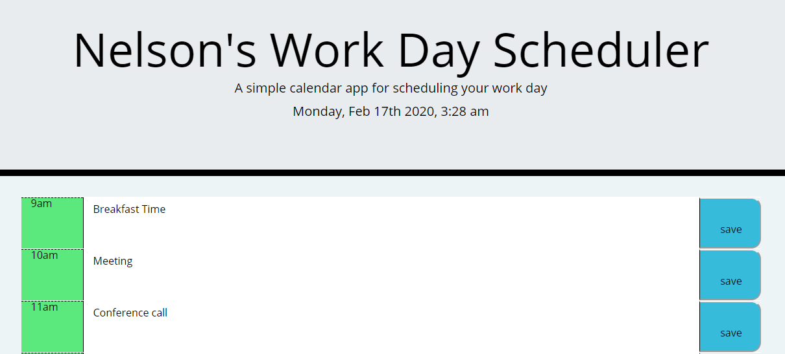

# Calender App
This is a Simple calender app. 
WHEN I open the planner, the current day is displayed at the top of my calendar.
If I scroll down the calender, then I am presented with timeblocks for standard business hours. 
WHEN I view the timeblocks for that day, then each timeblock is color coded to indicate whether it is in the past, present, or future. WHEN I click into a timeblock, I can enter an event and click the save button for that timeblock then the text for that event is saved in local storage.

ScreenShot (Schedular): 

Calender App link: "https://ezeume.github.io/calender/"

github link: https://github.com/ezeume/calender